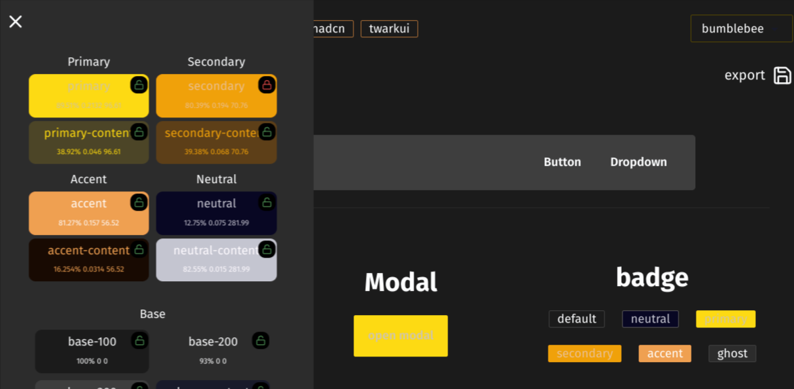
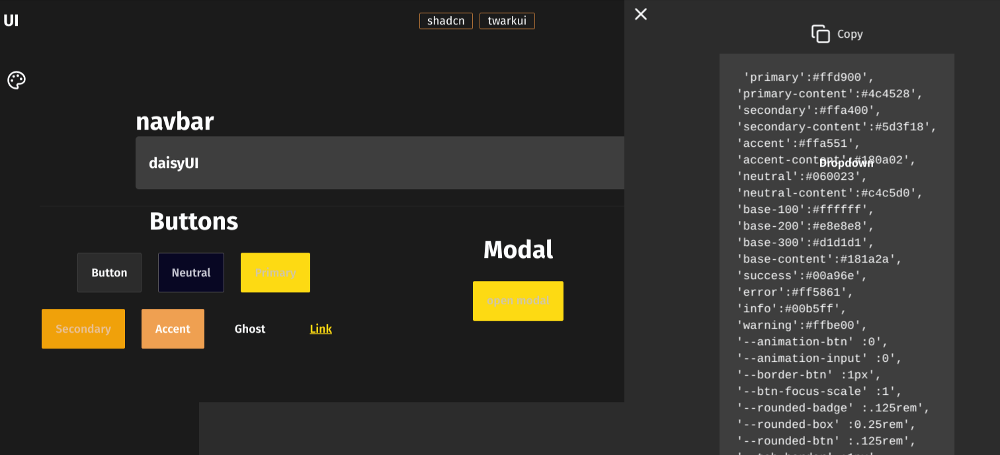

# Daisyui theme builder

inspired by [daisy ui theme builder](https://themes.ionevolve.com/) but all the state is stored in the URL making it

- sharable and revisatbale from history
- messed up? just hit the browser's back button
- start from the default daisyui themes , lock a specific value and switch the daisyui theme which will change every other value but the locked value to the new theme
- lock specific colors so that they don't change when you switch themes
  
- export theme
  
  [code on github](https://github.com/tigawanna/daisyui-theme-builder)


```html
<div data-scope="toast" data-part="group" dir="ltr" tabindex="-1" aria-label="bottom-end Notifications alt+T" id="toast-group:bottom-end" data-placement="bottom-end" data-side="bottom" data-align="end" aria-live="polite" role="region" style="position: fixed; display: flex; flex-direction: column; --gap: 16px; --first-height: 76px; z-index: 2147483647; align-items: flex-end; bottom: max(env(safe-area-inset-bottom, 0px), 1rem); inset-inline-end: calc(env(safe-area-inset-right, 0px) + 1rem);"><div data-scope="toast" data-part="root" dir="ltr" id="toast:toast:12" data-state="open" data-type="loading" data-placement="bottom-end" data-align="end" data-side="bottom" data-paused="" data-first="" role="status" aria-atomic="true" tabindex="0" type="success" class="toast__root min-w-[300px] bg-base-300 rounded-lg p-3  gap-1 z-50  " style="position: absolute; pointer-events: auto; --opacity: 1; --remove-delay: 200ms; --duration: 9007199254740991ms; --initial-height: 76px; --offset: 0px; --index: 0; --z-index: 1; --lift-amount: calc(var(--lift) * var(--gap)); --y: 0; --x: 0; bottom: 0px; --sign: 1; --lift: -1;" data-mounted="" data-overlap=""><div data-ghost="before" style="position: absolute; inset: 0px; scale: 1 2; pointer-events: none;"></div><div data-scope="toast" data-part="title" id="toast:toast:12:title" class="text-2xl font-bold">Warning</div><div data-scope="toast" data-part="description" id="toast:toast:12:description" class="text-sm">this is a warning toast</div><button class="button btn btn-link btn-sm absolute right-0 bottom-0 p-2" data-scope="toast" data-part="action-trigger" type="button">Action</button><button class="button btn btn-link btn-sm absolute right-0 top-0 p-2" id="toasttoast:12:close" data-scope="toast" data-part="close-trigger" type="button" aria-label="Dismiss notification"><svg xmlns="http://www.w3.org/2000/svg" width="24" height="24" viewBox="0 0 24 24" fill="none" stroke="currentColor" stroke-width="2" stroke-linecap="round" stroke-linejoin="round" class="lucide lucide-x"><path d="M18 6 6 18"></path><path d="m6 6 12 12"></path></svg></button><div data-ghost="after" style="position: absolute; left: 0px; height: calc(var(--gap) + 2px); bottom: 100%; width: 100%;"></div></div></div>


<div data-scope="toast" data-part="root" dir="ltr" id="toast:toast:1q" data-state="open" data-type="error" data-placement="top" data-align="center" data-side="top" role="status" aria-atomic="true" tabindex="0" class="toast__root toast--type__error" style="position: absolute; pointer-events: auto; --opacity: 1; --remove-delay: 200ms; --duration: 200000ms; --initial-height: 101px; --offset: 117px; --index: 1; --z-index: 51; --lift-amount: calc(var(--lift) * var(--gap)); 
--y: calc(var(--lift-amount) * var(--index)); --x: 0; top: 0px; --sign: -1; --lift: 1; --height: var(--first-height); --base-scale: var(--index) * 0.05 + 1; --scale: calc(-1 * var(--base-scale));" data-mounted="" data-sibling="" data-overlap=""><div data-ghost="before" style="position: absolute; inset: 0px; scale: 1 2; pointer-events: none;"></div><div data-scope="toast" data-part="title" id="toast:toast:1q:title" class="toast__title">Toast Title</div><div data-scope="toast" data-part="description" id="toast:toast:1q:description" class="toast__description">Toast Description</div><button class="button button--variant_link button--size_sm toast__actionTrigger" data-scope="toast" data-part="action-trigger" type="button">Action</button><button class="iconButton iconButton--variant_link iconButton--size_sm toast__closeTrigger" id="toasttoast:1q:close" data-scope="toast" data-part="close-trigger" type="button" aria-label="Dismiss notification"><svg xmlns="http://www.w3.org/2000/svg" width="24" height="24" viewBox="0 0 24 24" fill="none" stroke="currentColor" stroke-width="2" stroke-linecap="round" stroke-linejoin="round" class="lucide lucide-x"><path d="M18 6 6 18"></path><path d="m6 6 12 12"></path></svg></button><div data-ghost="after" style="position: absolute; left: 0px; height: calc(var(--gap) + 2px); bottom: 100%; width: 100%;"></div></div>


<div data-scope="toast" data-part="root" dir="ltr" id="toast:toast:21" data-state="open" data-type="error" data-placement="top" data-align="center" data-side="top" role="status" aria-atomic="true" tabindex="0" class="toast__root toast--type__error" style="position: absolute; pointer-events: auto; --opacity: 1; --remove-delay: 200ms; --duration: 200000ms; --initial-height: 101px; --offset: 234px; --index: 2; --z-index: 3; --lift-amount: calc(var(--lift) * var(--gap)); --y: calc(var(--lift-amount) * var(--index)); --x: 0; top: 0px; --sign: -1; --lift: 1; --height: var(--first-height); --base-scale: var(--index) * 0.05 + 1; --scale: calc(-1 * var(--base-scale));" data-mounted="" data-sibling="" data-overlap=""><div data-ghost="before" style="position: absolute; inset: 0px; scale: 1 2; pointer-events: none;"></div><div data-scope="toast" data-part="title" id="toast:toast:21:title" class="toast__title">Toast Title</div><div data-scope="toast" data-part="description" id="toast:toast:21:description" class="toast__description">Toast Description</div><button class="button button--variant_link button--size_sm toast__actionTrigger" data-scope="toast" data-part="action-trigger" type="button">Action</button><button class="iconButton iconButton--variant_link iconButton--size_sm toast__closeTrigger" id="toasttoast:21:close" data-scope="toast" data-part="close-trigger" type="button" aria-label="Dismiss notification"><svg xmlns="http://www.w3.org/2000/svg" width="24" height="24" viewBox="0 0 24 24" fill="none" stroke="currentColor" stroke-width="2" stroke-linecap="round" stroke-linejoin="round" class="lucide lucide-x"><path d="M18 6 6 18"></path><path d="m6 6 12 12"></path></svg></button><div data-ghost="after" style="position: absolute; left: 0px; height: calc(var(--gap) + 2px); bottom: 100%; width: 100%;"></div></div>

```


